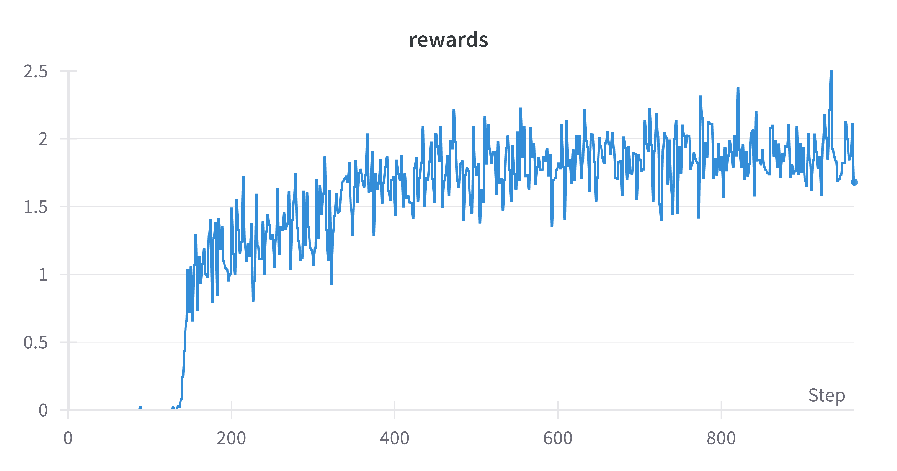
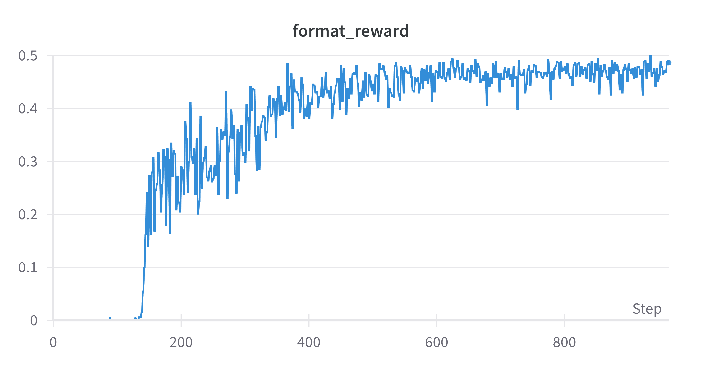

# GRPO_sample_trainer
This is simple implementation of GRPO trainer from scratch, without using the TRL. The repo supports multiple iteration of GRPO model updates, instead of a single step as implemented by TRL. Results will be uploaded below:

- [ ] Test modified Code
- [ ] TODO Qlora support.

## Results

### Training Metrics for 1 epoch

### Sample output from model
* check sample_output.csv in results folder.

Note: The table above is automatically generated from metrics.csv in the results folder.

