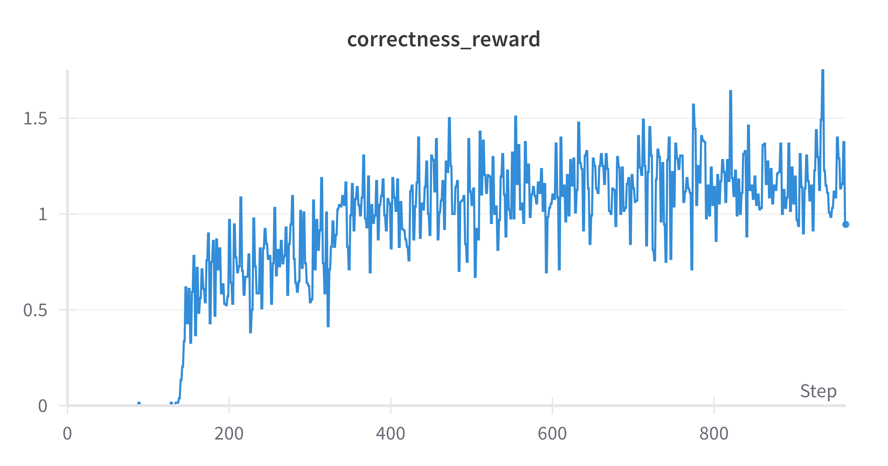

# GRPO_sample_trainer
This is simple implementation of GRPO trainer from scratch, without using the TRL. The repo supports multiple iteration of GRPO model updates, instead of a single step as implemented by TRL. 
 
To run the code:
* uv venv {env_name} --python=3.12
* source {env_name}/bin/activate
* uv pip install -r requirements.txt
* python trainer.py

### Settings
* Modify trainer.py to change input settings/data.

- [ ] Eval support.
- [ ] QLora

## Results

### Training Metrics for 1 epoch

### Sample output from model
* check sample_output.csv in results folder.

